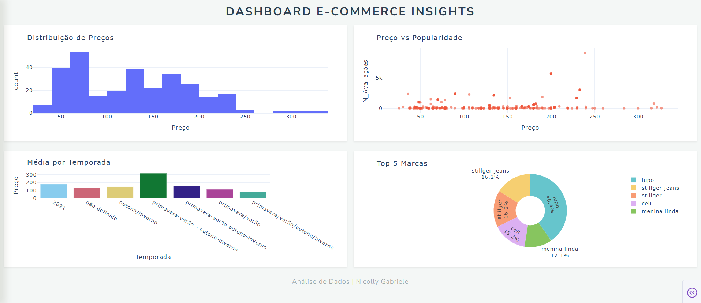

# 📊 E-commerce Insights Dashboard

Este projeto apresenta uma análise de dados de um marketplace de moda, focando no tratamento de dados (ETL), análise estatística e na criação de um Dashboard interativo para visualização de indicadores-chave (KPIs).

## 🚀 Objetivo
Transformar dados brutos de e-commerce em informações visuais que ajudem a entender o comportamento de vendas, o impacto de descontos por temporada e a participação das principais marcas no mercado.

---

## 🛠️ Tecnologias Utilizadas
- **Python 3.10+**
- **Pandas:** Manipulação, limpeza e tratamento de dados.
- **Plotly Express:** Criação de gráficos dinâmicos e interativos.
- **Dash:** Framework para desenvolvimento do dashboard web.
- **Visualização de Dados:** Histogramas, Gráficos de Dispersão, Heatmaps de Correlação e Gráficos de Pizza/Barras.

---

## 📈 Etapas do Projeto

### 1. Tratamento de Dados (ETL)
- Limpeza de valores nulos e duplicados.
- Normalização de colunas e preparação de métricas estatísticas para visualização.

### 2. Análise Exploratória (EDA)
- Identificação de correlações entre Preço, Nota e Volume de Avaliações.
- Análise de distribuição de preços para identificar o posicionamento dos produtos (popular vs. premium).

### 3. Dashboard Interativo
Desenvolvimento de uma interface web onde o usuário pode visualizar:
- **Distribuição de Preços:** Frequência de faixas de preço.
- **Relação Preço x Popularidade:** Como o preço influencia o número de avaliações.
- **Market Share por Marca:** As marcas com maior presença na base de dados.
- **Análise de Sazonalidade:** Média de preços por temporada (Primavera/Verão vs. Outono/Inverno).

---

## 📂 Estrutura do Repositório
- `data/`: Base de dados utilizada (`ecommerce_estatistica.csv`).
- `src/`: Código fonte da aplicação Dash.
- `README.md`: Documentação do projeto.

---

## 🔧 Como Executar
1. Instale as dependências: `pip install pandas dash plotly`
2. Rode o aplicativo: `python src/app.py`
3. Acesse no navegador: `http://127.0.0.1:8050/`